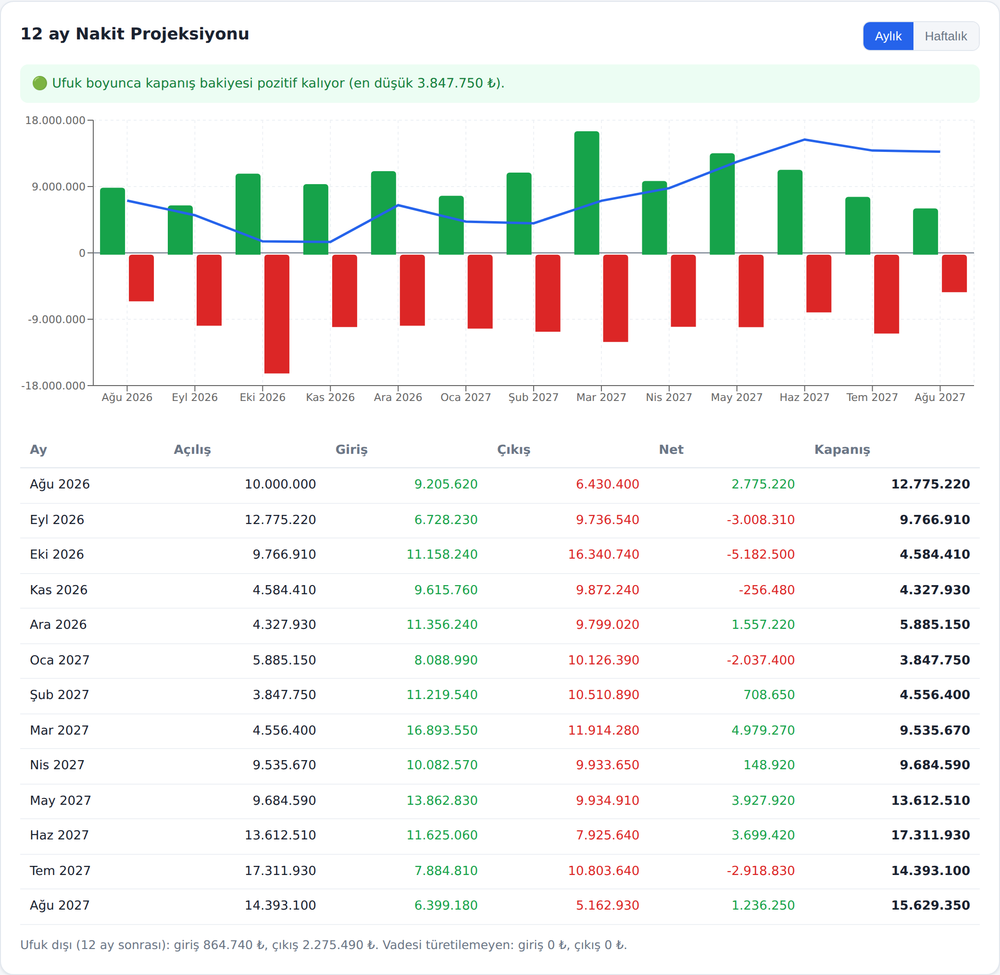
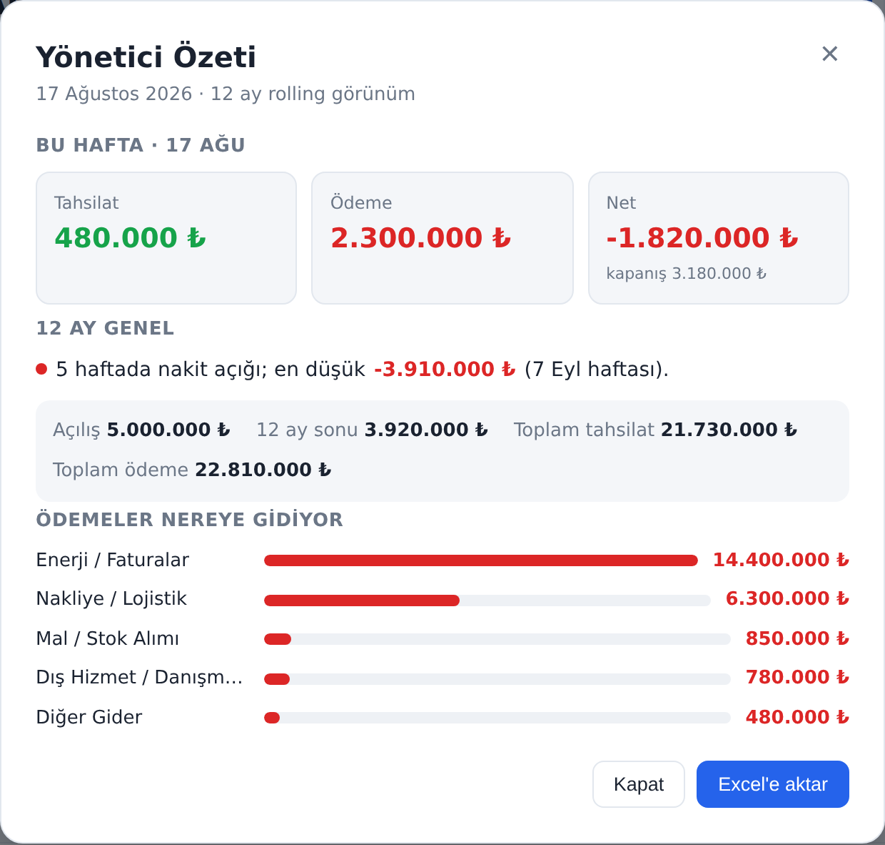
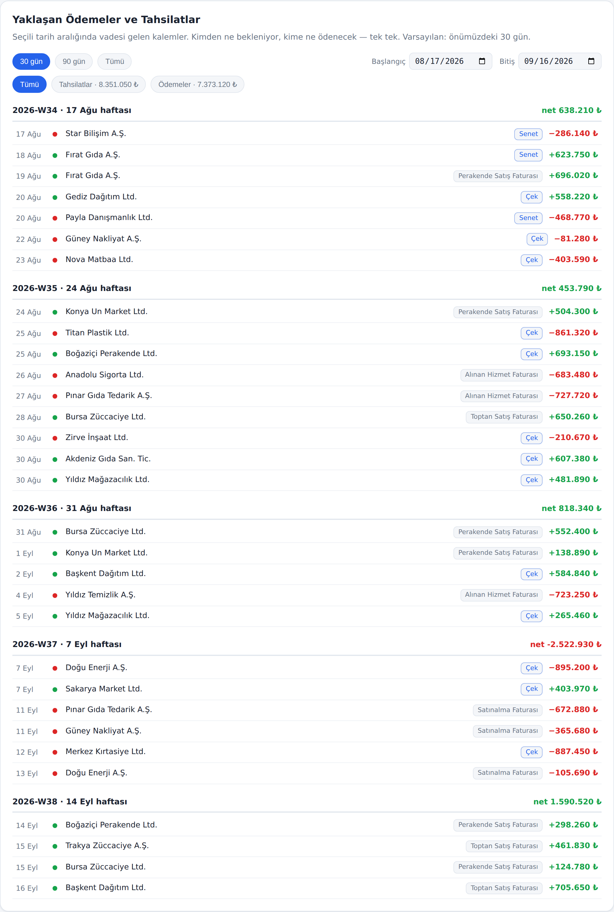

# 12-Month Cash Flow Projection · 12 Aylık Nakit Akışı

A rolling **cash-flow projection tool for Turkish SMEs** that turns raw Logo ERP exports
into a 12-month liquidity forecast — entirely in the browser, so financial data never
leaves the user's machine.

<p>
  
  
  
  
  
  
</p>

### ▶️ **[Live demo → cash-flow-12m.vercel.app](https://cash-flow-12m.vercel.app)**

> Upload a Logo "Borç Takip Raporu" (`.xlsx`) export and the app derives open items,
> flags data-quality gaps, and projects the next 12 months of cash. No account, no
> upload to a server — everything runs client-side. (Try it with the synthetic sample
> data described below.)



---

## The problem this solves

Small and mid-size companies in Turkey run on ERPs like **Logo**, but their cash-flow
planning still lives in fragile spreadsheets. The hard part isn't the arithmetic — it's
that **the source data can't be trusted as-is**:

- Logo backfills a missing due date with the invoice date, so *missing* data looks
  *valid*. On the first real export inspected during development, **97.7% of open items
  had `due_date == doc_date`** — an unusable due date masquerading as a real one.
- Cheques and promissory notes (`çek/senet`) are both a receivable **and** a payment
  instrument once endorsed — Western cash-flow templates have no concept of them.
- The report that lists movements isn't the report that lists *open* items; picking the
  wrong export silently produces a wrong forecast.

Rather than trusting the ERP, this tool **derives** what it can and **measures** what it
can't — and shows the user exactly where the gaps are.

---

## What it does

- **Opening position** — enter cash + bank balances (last night's close); mark
  blocked/collateral accounts so they're excluded from available cash.
- **Open-item adapter** — reads the Logo *Borç Takip Raporu*, separates invoices from
  cash movements, derives each item's open balance, and flags suspicious due dates.
- **Effective-due-date derivation** — since ERP due dates are unreliable, real due dates
  are derived from a priority chain (manual override → reliable ERP date → per-party
  payment term → assumed), each tagged with its confidence.
- **Cheque / promissory-note portfolio** — received cheques add to inflow on their due
  week, issued cheques to outflow; collateral / endorsed / bounced items are set aside.
- **Rolling projection** — 13 weeks / 6 months / **12 months** (default), with a
  weekly ↔ monthly view, three scenarios (pessimistic / base / optimistic), and a
  running closing balance.
- **Income/expense categories** — each flow is categorised (tax, payroll, stock, rent,
  energy…) so the executive view answers *where the money goes*.
- **Data-quality panel** — surfaces the gaps in the source data as numbers, not silence.
- **Executive summary** — a one-glance modal for managers.
- **Excel/CSV export** — pick which sections to export.

| Executive summary | Upcoming payments & collections |
|---|---|
|  |  |

---

## Architecture

A layered design keeps the core independent of any one ERP:

```
Logo export (.xlsx)
      │
  ADAPTER LAYER        src/adapters/logo   — source-specific, its only job is to translate
      │
  CORE MODEL           src/core            — open_item, instrument, cash position, category
      │
  DERIVATION LAYER     src/derive          — effective due date, per-party term, delay
      │
  PROJECTION ENGINE    src/projection      — weekly buckets, monthly rollup, scenarios
      │
  PRESENTATION         src/components      — React UI (thin layer over tested logic)
```

- **Privacy by design.** No backend, no database, no accounts. The `.xlsx` is parsed in
  the browser with ExcelJS; nothing is ever sent to a server. The app is a static site.
- **Tested core.** The engine is pure TypeScript with **39 unit tests** (Vitest); the UI
  is a thin layer on top.
- **Design record.** The full data-model design (in Turkish) lives in
  [`docs/veri-modeli-v1.md`](docs/veri-modeli-v1.md).

---

## Tech stack

**TypeScript · React 18 · Vite · Recharts · ExcelJS · Vitest** — deployed on **Vercel**.

## Run locally

```bash
npm install
npm run dev        # dev server
npm run build      # production build
npm test           # 39 unit tests
```

Inspect the data quality of an export from the command line (no UI):

```bash
npm run inspect:report -- /path/to/borc-takip.xlsx
```

## Privacy & security

- **Data never leaves the browser** — all parsing and computation is client-side.
- Uploaded files and any real customer data are git-ignored and never committed.
- CSV export is hardened against spreadsheet formula injection; no `innerHTML`/`eval`
  is used anywhere (React escapes all file-derived text).

## License

Proprietary — **all rights reserved**. The source is public to read, but may not be
copied, reused, or redistributed without permission. See [`LICENSE`](LICENSE).

## Author

Built by [**@begumszone**](https://github.com/begumszone).
